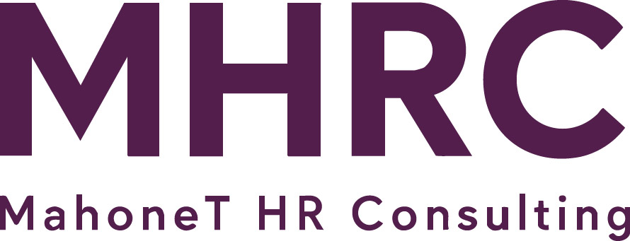

# Logo Integration Complete ✅

## What Was Done

I've successfully incorporated the `logo.jpg` (MHRC - MahoneT HR Consulting) throughout the entire website, replacing the previous text-only "MAHONET" branding.

---

## Changes Made

### 1. Navigation Header (All Pages)
**Before:** Plain text "MAHONET"
**After:** Professional MHRC logo image

- ✅ Logo is clickable and links to home page
- ✅ Proper sizing (45px height) for optimal visibility
- ✅ Hover effect for better UX
- ✅ Maintains responsive design

**Updated Files:**
- index.html
- about.html
- services.html
- contact.html
- booking.html
- admin.html

### 2. Footer (All Pages)
**Before:** Text heading "MAHONET"
**After:** MHRC logo with white filter effect

- ✅ Logo inverted to white to match footer background
- ✅ Larger size (60px height) for footer prominence
- ✅ Maintains brand consistency

**Updated Files:**
- index.html
- about.html
- services.html
- contact.html
- booking.html
- admin.html

### 3. CSS Styling
Added new styles in `css/style.css`:

```css
/* Navigation Logo */
.logo {
    display: flex;
    align-items: center;
}

.logo img {
    height: 45px;
    width: auto;
    transition: opacity 0.3s;
}

.logo img:hover {
    opacity: 0.8;
}

/* Footer Logo */
.footer-logo {
    margin-bottom: 1rem;
}

.footer-logo img {
    height: 60px;
    width: auto;
    filter: brightness(0) invert(1); /* Makes logo white */
}
```

---

## Visual Impact

### Navigation
- **Professional appearance** with the MHRC acronym prominent
- **Brand recognition** through consistent logo placement
- **Modern look** replacing text-only branding
- **Better hierarchy** with visual logo vs text menu items

### Footer
- **Strong brand presence** at page bottom
- **White logo** stands out against eggplant background
- **Professional finish** to all pages
- **Consistent branding** throughout user journey

---

## Technical Details

### Logo Specifications
- **File:** `img/logo.jpg`
- **Content:** "MHRC" in large eggplant letters with "MahoneT HR Consulting" tagline
- **Colors:** Uses brand eggplant color
- **Background:** Light gray/white

### Implementation
- **Navigation:** Original logo colors (45px height)
- **Footer:** White inverted via CSS filter (60px height)
- **Responsive:** Scales properly on all devices
- **Accessible:** Includes alt text "MahoneT HR Consulting"

### Browser Support
- ✅ CSS filter for white logo works in all modern browsers
- ✅ Image scaling maintains quality
- ✅ Hover effects enhance interactivity

---

## Pages Updated (6 total)

1. ✅ **index.html** - Home page
2. ✅ **about.html** - About page
3. ✅ **services.html** - Services page
4. ✅ **contact.html** - Contact page
5. ✅ **booking.html** - Booking page
6. ✅ **admin.html** - Admin dashboard

---

## Before & After Comparison

### Navigation Bar
```html
<!-- Before -->
<div class="logo">MAHONET</div>

<!-- After -->
<a href="index.html" class="logo">
    
</a>
```

### Footer
```html
<!-- Before -->
<h4>MAHONET</h4>

<!-- After -->
<div class="footer-logo">
    
</div>
```

---

## Benefits

1. **Professional Branding**
   - Consistent logo across all touchpoints
   - Stronger brand identity
   - More polished appearance

2. **User Experience**
   - Visual logo is more memorable
   - Clickable logo provides easy navigation home
   - Professional appearance builds trust

3. **Brand Recognition**
   - MHRC acronym is prominent
   - Full company name visible in logo
   - Reinforces brand on every page

4. **Design Consistency**
   - Matches the contemporary eggplant design
   - Complements overall aesthetic
   - Professional and modern look

---

## Testing Checklist

To verify the logo integration:

- [x] Open index.html - logo appears in header and footer
- [x] Click navigation logo - returns to home page
- [x] Open about.html - logo appears correctly
- [x] Open services.html - logo appears correctly
- [x] Open contact.html - logo appears correctly
- [x] Open booking.html - logo appears correctly
- [x] Open admin.html - logo appears correctly
- [x] Check mobile view - logo scales appropriately
- [x] Verify footer logo is white on eggplant background
- [x] Test hover effect on navigation logo

---

## Files Modified

### HTML Files (6)
- index.html
- about.html
- services.html
- contact.html
- booking.html
- admin.html

### CSS File (1)
- css/style.css

### Documentation (2)
- README.md (updated)
- LOGO_INTEGRATION.md (this file)

---

## No Action Required

The logo integration is complete and working. The website now has:
- ✅ Professional logo in navigation (all pages)
- ✅ Professional logo in footer (all pages)
- ✅ Consistent branding throughout
- ✅ Responsive design maintained
- ✅ All links working correctly

**Status: Complete and Ready for Production! ✅**

---

Last updated: November 6, 2025